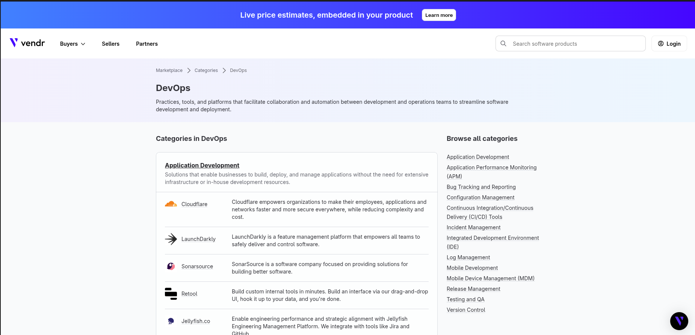
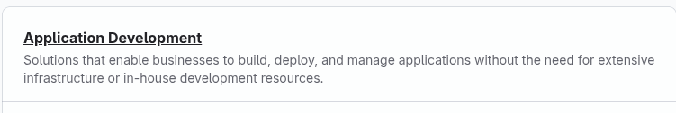
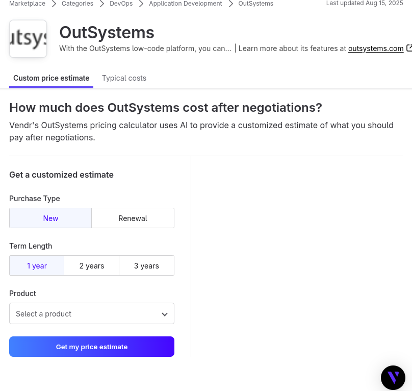
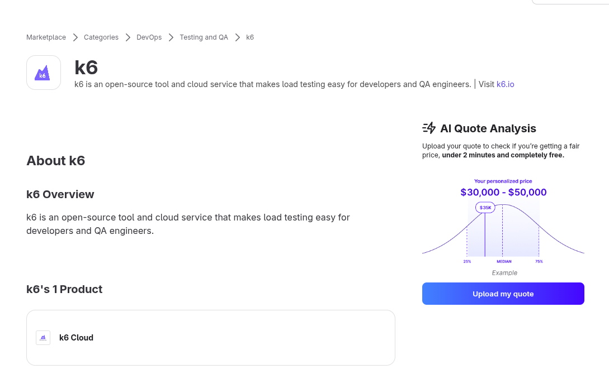

# Describe parse

How to get data from this site:

### We have this site

### From this site, give all (Application Development)

## Create URL with JSON to get necessary data:
- **position** = DevOps
- **i** = Number of the page to parse

https://www.vendr.com/categories/{position}/{re_name_category}?page={i}&_data=routes%2F_marketplace.categories.%24categorySlug.%24subCategorySlug._index

## Okay
We can create this:

https://www.vendr.com/marketplace/outsystems

# Without checking the catalog, we can't get all companies.

- But in the end, we can't parse all data because some require payment.

- Or for something need loging in account and wait 2 min

